> Written by Max Wilén (maxwi734) & Xiaoqi Jiang(xiaji430)

# Questions

## Q1

> [!NOTE] Question
> Start by identifying and describing a set of preparatory activities that you believe can be useful to engage in before carrying out code changes to the project. What do you need to learn more about? How can you study the techniques, tools, theoretical underpinnings or algorithms employed in the project before making your own contributions?

- Clone the repo and start the development stack
- Do some light GUI testing to get a feel for the application
- Read documentation covering architecture and codestyle
- Perform a technical deep dive into how each component (backend, server, frontend) comunicates with each other
- Review the contribution guidelines

## Q2

> [!NOTE] Question
> Identifying one or a few minor tasks that are specifically suitable for a new developer who wished to contribute to the project. You should be able to justify why these particular issues are suitable, by referring to their description, conversations with developers in the project or other means. The tasks can involve writing documentation, translating and interface or fixing a minor bug.

Here follows the minor tasks that we have identified when looking at the list of open issues

### Issue 1 [#18325]

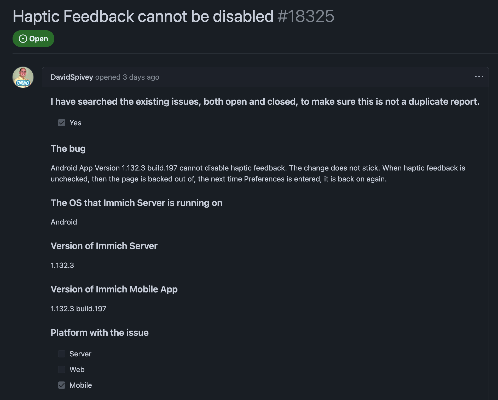
> [!IMPORTANT] Issue-info
> Looks to be a pure-flutter/android change -> no db or server change needed

### Issue 2 [#18284]

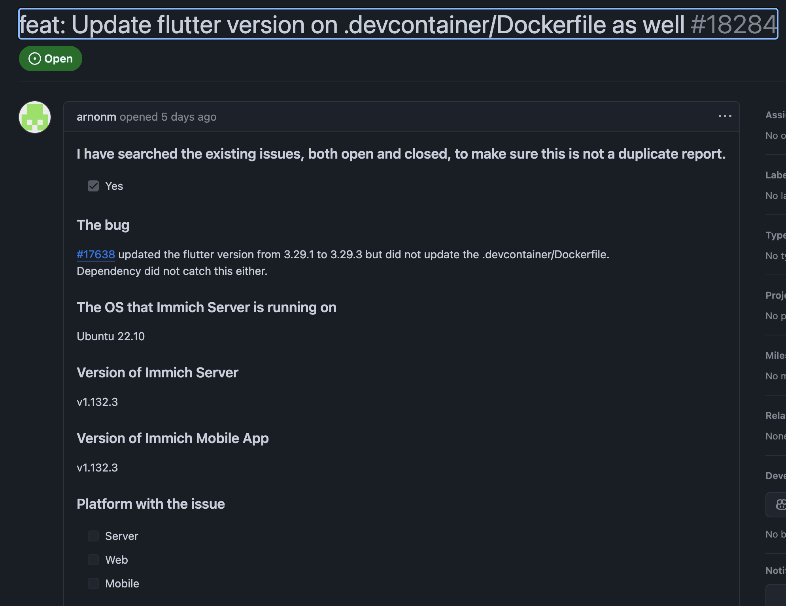
> [!IMPORTANT] Issue-info
> Looks to be a simple change in the Dockerfile, and some documentation changes. Should not cover any actual development.

### Issue 3 [#17757]

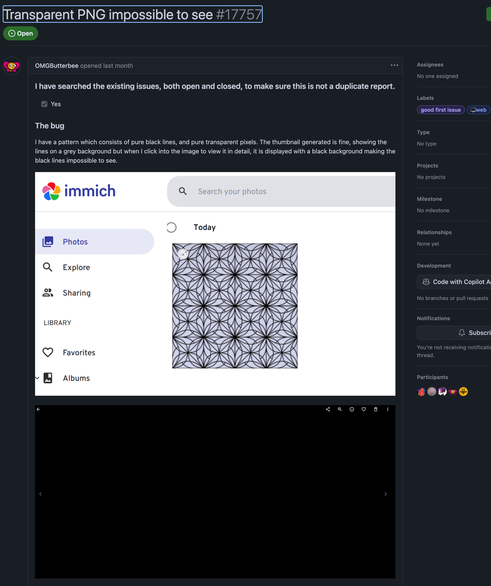
> [!IMPORTANT] Issue-info
> The problem lies in transparent images not being handled properly by the GUI -> The transparent content gets filled with black instead. This makes it so that black content on a transparent background gets impossible to see when displaying it both in thumbnail and preview sizes in the UI.

>[!TIP] Potential fix
> We can fix this looking at how png files, or transparent images more specifically, are handled by the app. Both during upload, download and viewing. Maybe there is a default file type that each image gets converted to before the UI can handle the image that is displayed, and that is what causing the problem...?


## Q3

> [!NOTE] Question
> Choose one of the minor task and resolve it in a feature branch in your own forked repository. (You may submit it to the project as a pull requirest if you want!) Describe in detail how you did go about resolving the issue.

We have decided to fix issue 3 [#17757]. To do this, we need to perform the following steps:

1. Fork repo and branch to issue-branch
2. Reproduce the bug/error (thing to fix)
3. Locate the code that needs to be changed
4. Perform changes
5. Validate that the change actually removes the problems/errors/bugs.
6. Create a PR with an issue-fix statement
7. Wait and see if your commit gets accepted

### Lets try to fix the issue :)

We first looked at trying to isolate if there where any UI styling that was causing the transparent background to become black. First, we found the code that is generating the background of the modal (pop-up preview window) inside file: `immich-fork/web/src/lib/components/asset-viewer/photo-viewer.svelte`

```html

```

But this had no control of the content of the image. Only acctually linking which image to display.

We then identified the same type of code but for the thumbnail generation.

```html
<!-- Here the transparency coloring is put on the thumbnails -->
<div
  data-asset={asset.id}
  class={[
    'focus-visible:outline-none flex overflow-hidden',
    disabled ? 'bg-gray-300' : 'bg-immich-primary/20 dark:bg-immich-dark-primary/20',
  ]}
  style:width="{width}px"
  style:height="{height}px"
>
```

But this didnt really lead us anywhere...

After some googling and browsing through the settings, we found out that immich has an admin-setting that tells the app which format the thumbnail, preview and fullscreen images should be in - and these where set to `JPEG` as default! 

This causes problems because `JPEG` images cant have transparent content, so on upload of a `PNG` image, the file gets converted to a `JPEG` file (the original `PNG` file stored aswell for later download), which makes the transparent content of the new `JPEG` turn black. To fix this, we need to find the code that sets the default settings and maybe add some styling for the thumbnail and preview.

### Complete and functional fixes

#### Change default setting

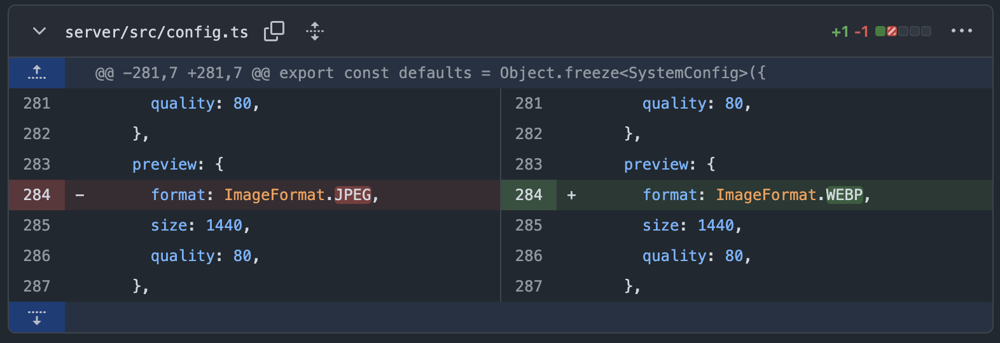

#### Styling change

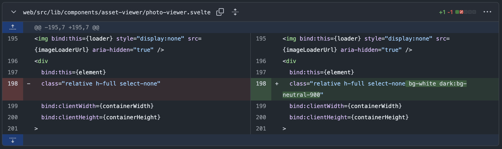


### End result

#### Original images


<div>
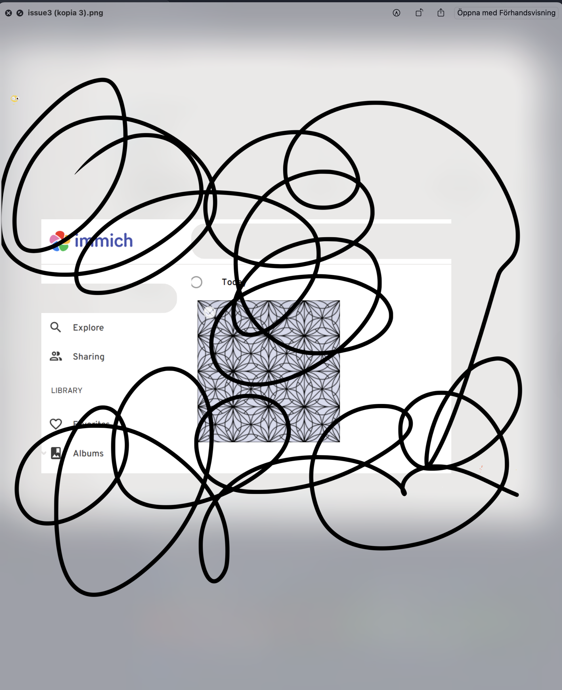
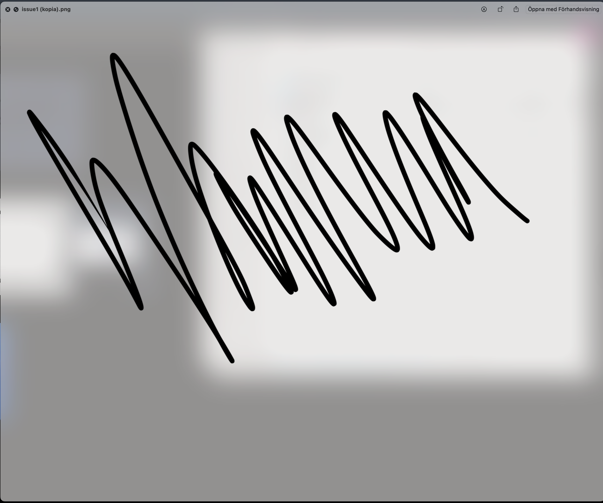
</div>

#### Thumbnail view

<div>
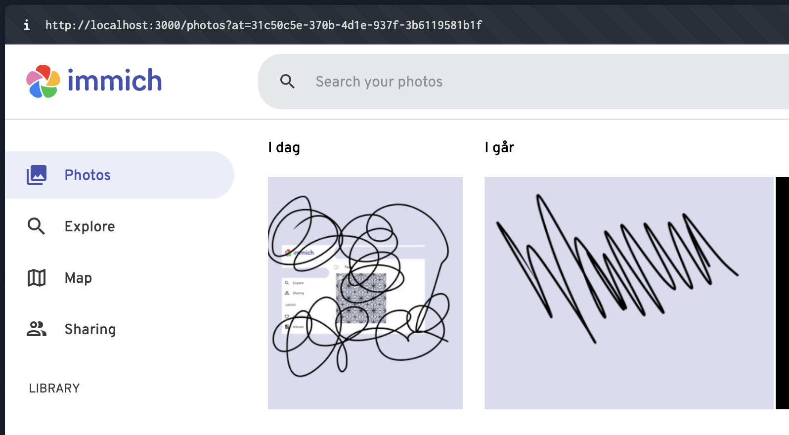
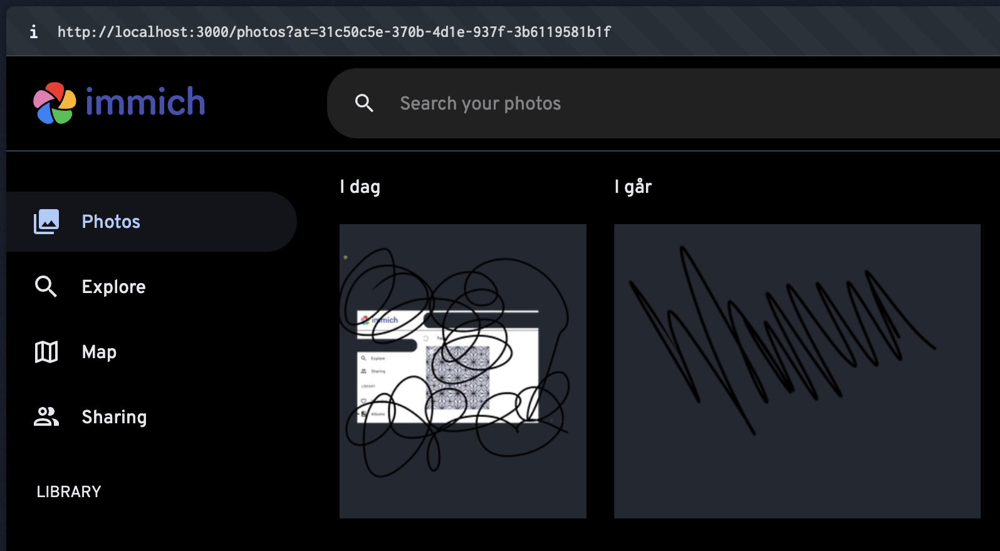
</div>

#### Preview view

<div>
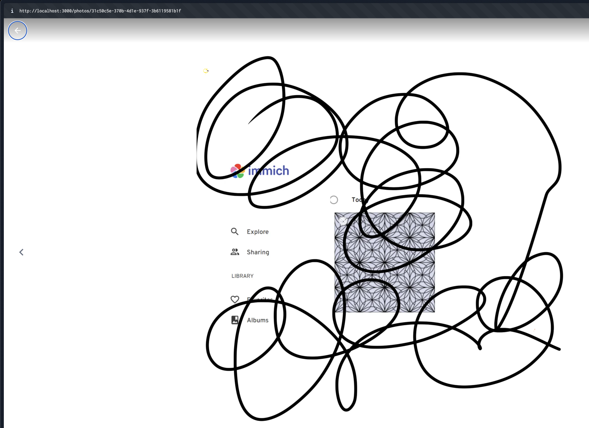
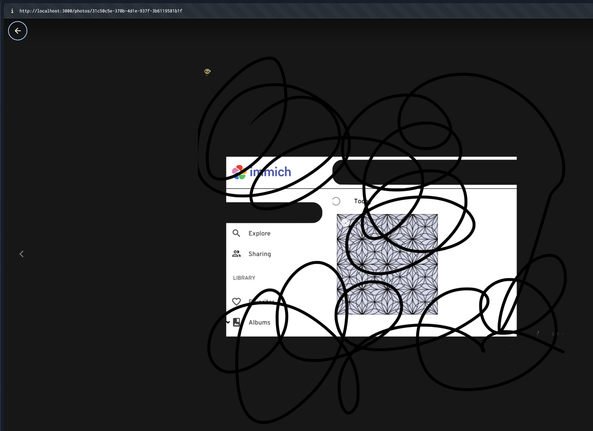
</div>

## Q4 & Q5

>[!NOTE] Question
> Give examples of a (set of) final larger contribution(s) that you would like to make to the project based on previous contributions to the project, and currently open issues.
>
> Make a time plan for those contributions, taking into account time for learning about new techniques that are relevant, as well as the review process for contributions. Make sure to justify your estimates of review time based on earlier reviews, and include concrete activities that you plan to engage in to learn necessary skills to be able to contribute in the project.

### 1. Introduction

Currently, Immich lacks basic photo editing capabilities such as cropping, rotating, or adjusting brightness/contrast, forcing users to export photos to external apps for basic adjustments. Adding these features would greatly improve user experience by allowing simple edits without leaving the app. This function aligns with both project direction and user requests.

### 2. Scope of Contribution

The scope of contribution is to begin implementing basic photo editing capabilities, starting with the crop image feature. This will lay the foundation for other editing tools in the future.

The goal includes:

- Creating a UI in the web app that lets users crop an image.
- Adding a backend endpoint to process and save the cropped version.
- Ensuring users can choose to replace the original or save a new copy.

### 3. Preparatory Activities

- Study existing Immich code structure related to photo upload and management.
- Explore tools and libraries suitable for image cropping in SvelteKit.
- Learn how to use image processing libraries like `sharp` in a Node.js backend.
- Review similar open-source projects that implement photo editing features.

### 4. Time Plan

| Week | Activities                                        |
| ---- | ------------------------------------------------- |
| 1–2  | Explore Immich codebase and relevant libraries    |
| 3    | Draft design of crop feature (frontend & backend) |
| 4–5  | Implement crop UI and backend API                 |
| 6    | Test and refine functionality                     |
| 7    | Submit pull request and respond to feedback       |

Based on previous community PR timelines, review time will take around one week. If additional feedback or adjustments are needed, we can handle them in Week 8.

### 5. Future Contribution

After completing the crop feature, We may continue expanding Immich's editing tools such as rotate image and adjust brightness/contrast. These features can build upon the same technical foundation, reusing UI components and backend logic.
